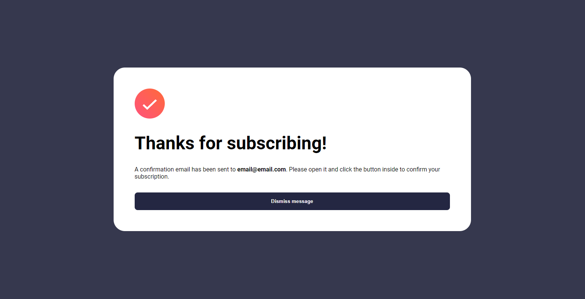

# Frontend Mentor - Formulário de cadastro de newsletter com mensagem de sucesso

A minha solução para o desafio [Newsletter signup form with success message](https://www.frontendmentor.io/challenges/newsletter-signup-form-with-success-message-3FC1AZbNrv).

## Índice

- [Geral](#geral)
  - [Screenshot](#screenshot)
  - [Construido Com](#tecnologias)
- [Autor](#author)

## Geral

### Screenshots

#### Design padrão Desktop

#### Mensagem de sucesso

#### Design padrão Mobile

### Tecnologias

- HTML5
- CSS
- CSS Grid
- Design Responsivo
- JavaScript

## Autor

- GitHub - [Meu repositório](https://github.com/snowzzrra)
- Frontend Mentor - [@snowzzrra](https://www.frontendmentor.io/profile/snowzzrra)
- LinkedIn - [Meu LinkedIn](https://www.linkedin.com/in/guilherme-paim-motta-b4942b232/)
