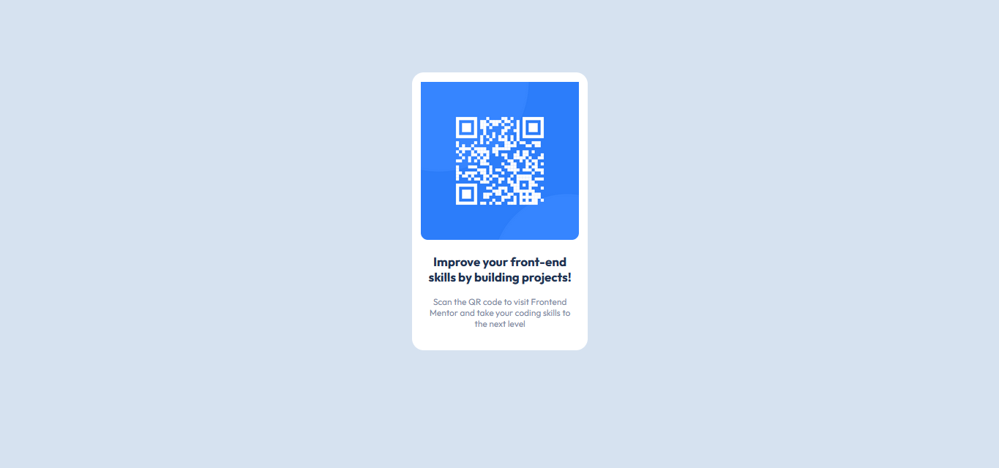
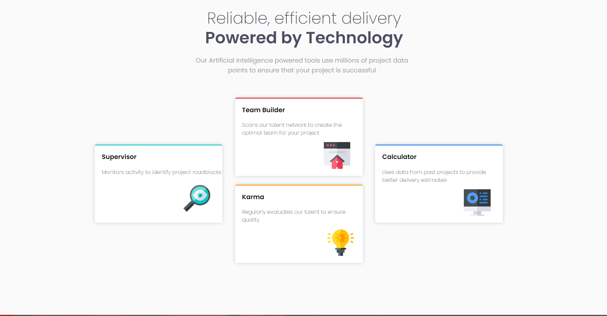
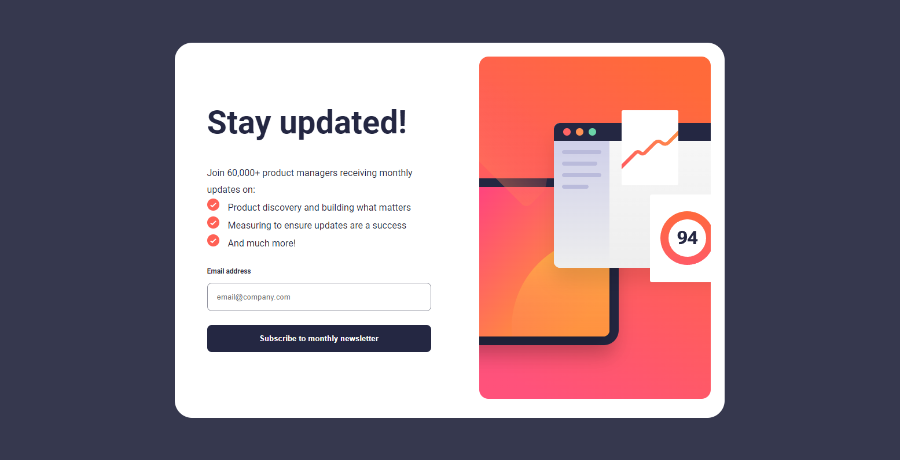
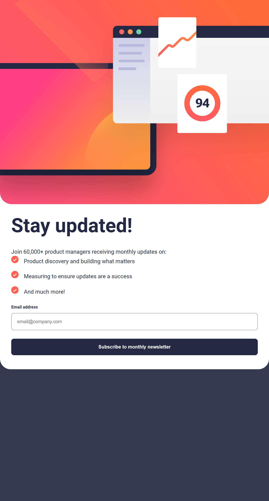
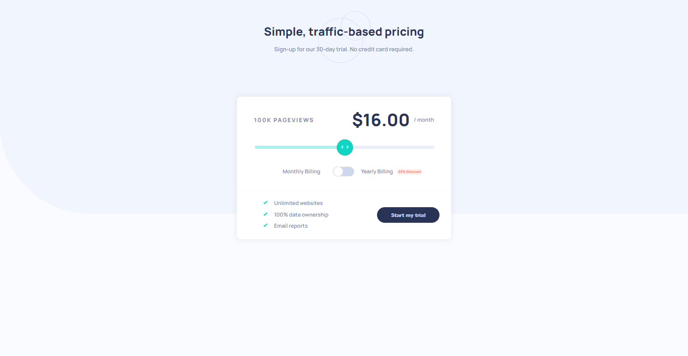
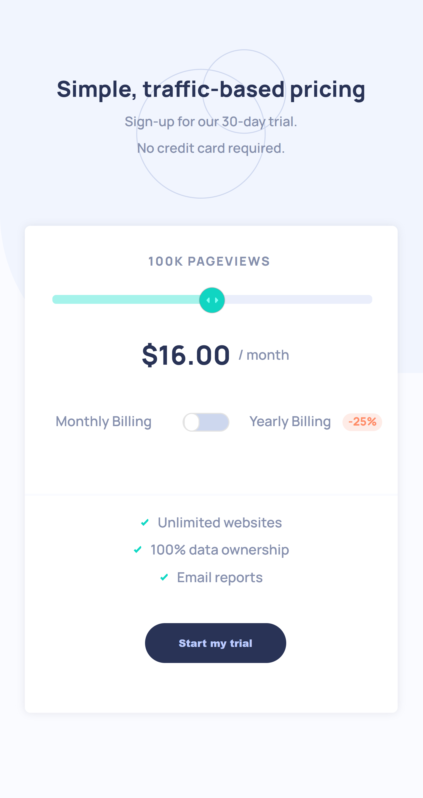

# Portfólio - Guilherme Paim Motta
Onde pretendo colocar meus projetos curtos Front-End, a maioria no site [Frontend Mentor](https://www.frontendmentor.io).

## Índice

- [Projetos](#projetos)
  - [QRCode](#qrcode)
  - [PreviewCard](#previewcard)
  - [FourCardFeature](#fourcardfeature)
  - [NewsletterForm](#newsletterform)
  - [PricingComponent](#pricingcomponent)
- [Links](#links)

## Projetos

### QRCode

Um projeto curto simulando um site com um único QRCode, feito para iniciar o básico em HTML/CSS.

[Link no Pages.](https://snowzzrra.github.io/projetos-portfolio/QRCode/index.html)

### PreviewCard

Um card mostrando um produto, sendo interativo no botão.

[Link no Pages.](https://snowzzrra.github.io/projetos-portfolio/PreviewCard/index.html)

### FourCardFeature

Uma seção com quatro cards destacando, usando grid para posicionar.

[Link no Pages.](https://snowzzrra.github.io/projetos-portfolio/FourCardFeature/index.html)

### NewsletterForm

Um formulário para se cadastrar em um newsletter, tendo mensagem tanto de sucesso quanto de falha por meio do JavaScript. Design responsivo, funcionando em celulares.

[Link no Pages.](https://snowzzrra.github.io/projetos-portfolio/NewsletterForm/index.html)

### PricingComponent

Uma página para um cálculo de preço, usando uma barra de controle de alcance que determina a quantidade de visualizações na página. Um script logo depois coloca o preço equivalente a quantidade escolhida, também dando desconto ou não dependendo da opção de pagamento escolhida. Utiliza vários pseudo-elementos, especialmente nos dois inputs. O design é completamente responsivo, funcionando bem tanto em computadores quanto em celulares.

[Link no Pages.](https://snowzzrra.github.io/projetos-portfolio/PricingComponent/index.html)

## Links

- GitHub - [Meu repositório, você provavelmente está aqui.](https://github.com/snowzzrra)
- Frontend Mentor - [@snowzzrra](https://www.frontendmentor.io/profile/snowzzrra)
- LinkedIn - [Meu LinkedIn.](https://www.linkedin.com/in/guilherme-paim-motta-b4942b232/)